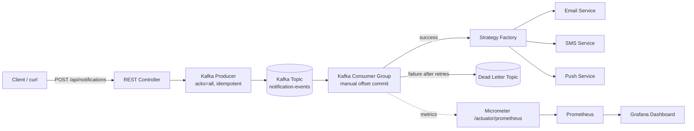

<div align="center">


<a href="https://github.com/Om20An00/event-driven-notification-system">
  
</a>

<br/>


</div>

---

## 📖 About This Project

A **production-shaped**, event-driven notification system that decouples request handling from message delivery using **Apache Kafka**. Built solo, end-to-end — from the Kafka reliability internals to a live Prometheus/Grafana observability stack scraping real runtime metrics.

Instead of an API blocking on an email/SMS/push provider, this system publishes an event and returns instantly — a consumer group handles delivery asynchronously, with retries, dead-lettering, and full observability baked in.

> 🧠 **Author's note:** This project was designed and built entirely by me — architecture, code, testing, containerization, and the monitoring integration — as a hands-on deep dive into distributed, event-driven systems.

---

## 🏗️ Architecture



---

## ✨ Features

| Category | What's Implemented |
|---|---|
| **Messaging** | Kafka producer with `acks=all` for idempotent, no-duplicate delivery |
| **Reliability** | Manual offset commits + automatic retry-then-dead-letter-topic (DLQ) routing |
| **Extensibility** | Strategy pattern (`NotificationService` interface + factory) — add new channels without touching consumer logic |
| **Channels** | Email, SMS, and Push notification dispatch |
| **Testing** | Integration tests using Spring Kafka's **embedded broker** — validates the full producer → consumer flow |
| **Containerization** | Dockerfile + Docker Compose running Kafka in **KRaft mode** (no Zookeeper) |
| **Scaling (prepared)** | Kubernetes manifests — Deployment, Service, and HPA — ready to apply to a cluster |
| **Observability** | Spring Boot Actuator + Micrometer exposing `/actuator/prometheus`, scraped live by a companion [Kubernetes-Monitoring-Dashboard](https://github.com/Om20An00/Kubernetes-Monitoring-Dashboard) project (Prometheus + Grafana) |

---

## 🛠️ Tech Stack

<div align="center">


</div>

---

## 🚀 Getting Started

### Prerequisites

- JDK 17
- Maven
- Docker Desktop
- (Optional) VS Code with the *Extension Pack for Java* + *Spring Boot Extension Pack*

### 1. Clone the repository

```bash
git clone https://github.com/Om20An00/event-driven-notification-system.git
cd event-driven-notification-system
```

### 2. Start Kafka

```bash
docker compose up -d kafka kafka-ui
```

Wait ~20–30 seconds for the health check to pass.

### 3. Run the application

```bash
mvn spring-boot:run
```

You should see `Started NotificationSystemApplication` in the logs.

### 4. Send a test notification

```bash
curl -X POST http://localhost:8080/api/notifications \
  -H "Content-Type: application/json" \
  -d '{"type":"EMAIL","recipient":"user@example.com","subject":"Welcome!","message":"Hi there"}'
```

### 5. Inspect Kafka visually

Open [http://localhost:8081](http://localhost:8081) to see the `notification-events` topic in Kafka UI.

### 6. Stop everything

```bash
docker compose down
```

---

## 📊 Metrics & Monitoring (Optional but Recommended)

This project exposes Prometheus-compatible metrics out of the box at:

```
http://localhost:8080/actuator/prometheus
```

Pair it with the companion **[Kubernetes-Monitoring-Dashboard](https://github.com/Om20An00/Kubernetes-Monitoring-Dashboard)** repo (Prometheus + Grafana) to get live panels for:

- Notifications consumed / published
- JVM heap usage & live threads
- CPU usage
- GC pause time

---

## 📸 Screenshots

<div align="center">

| Prometheus Targets | Grafna Login |
|:---:|:---:|
|  |  |

| Dashboard | Actuator / Prometheus Endpoint |
|:---:|:---:|
|  |  |

| Prometheus Query Explorer | Grafana Dashboard — Metrics Panel |
|:---:|:---:|
|  |  |

| Grafana Dashboard — Full View |
|:---:|
|  |

</div>


---

## ☸️ Kubernetes (Manifests Included)

Manifests are provided under `k8s/` as a starting point for horizontal scaling — they are **not deployed by default**:

```bash
kubectl apply -f k8s/
```

Includes `Deployment`, `Service`, and `HorizontalPodAutoscaler` for scaling consumers via Kafka partition-based load distribution.

---

## 🔮 Roadmap / Future Enhancements

- [ ] Redis for producer-side idempotency dedup and caching
- [ ] Increase Kafka partitions for true consumer-group parallelism
- [ ] Live deployment to a Kubernetes cluster (minikube/kind → cloud)
- [ ] Webhook / Slack notification channel via the existing strategy pattern

---

## 🍴 Forking & Cloning

This repository is open for learning purposes. If you'd like to explore, run, or build on top of it:

```bash
# Clone directly
git clone https://github.com/Om20An00/event-driven-notification-system.git

# Or fork it via the GitHub UI (top-right "Fork" button) to make your own copy
```

If you fork this project or use it as a reference/base for your own work, a ⭐ star or a mention/credit back to this repo is appreciated but not required. Pull requests with genuine improvements are welcome — please open an issue first to discuss what you'd like to change.

---

## 👤 Author

**Om** — [@Om20An00](https://github.com/Om20An00)

This project, including its architecture, code, tests, and monitoring integration, was designed and built entirely by me as an independent, hands-on project.

<div align="center">

If this project helped you or you found it interesting, consider giving it a ⭐!


</div>
